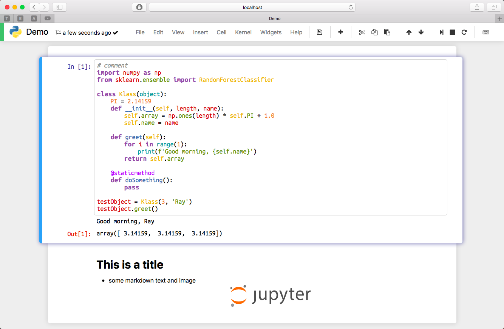

# Adrastea
This is a collection of Jupyter extensions to supercharge  your Notebook with better UI and functionality. 

## Features

* A modern and simple look without occupying your precious vertical space
* Vibrant syntax highlighting based on a modified [Tomorrow Theme](https://github.com/chriskempson/tomorrow-theme)

## Screenshot



## Installation

```shell
git clone https://github.com/red8012/Adrastea.git
cd Adrastea
jupyter nbextension install AdrasteaNotebookExtension
jupyter nbextension enable AdrasteaNotebookExtension/main
```

## Limitations and Warnings

* Only tested on latest macOS and Safari / Chrome
* It may break things (especially when you are also using other extensions)
* Python 3.6 is awesome. I don't want to support older versions.